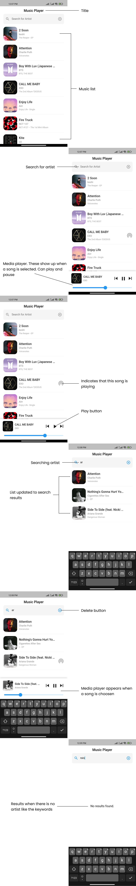

# Music Player App in Flutter

## Introduction
A simple music player app that lets you search by artist  and displays the search results on the screen. When a song is selected from the list, the song starts to play.

## Supported Devices
- Redmi Note 9
- Realme 5i
- Realme 2

## Supported Features
- Play a song => When a song is selected from the list, the song starts to play and the media player will be shown at the bottom of the screen. When a song is selected and playing at that time, the song will have indicators that this song is playing.
- Pause or resume a song => When you want to pause or resume a song you played, you can just press the pause/resume button in the media player.
- Completion of song => When the song's duration is over, the song will be stopped and the seek bar will return to starting position.
- Search a song by artist => You can search a song by typing the artist name in the search bar, when searching the playback will not stopped. The media player will hidden until you choose the next song to be played.
- Delete words in the search bar => If you done searching a song, you can delete it by press the delete button.

## List of Libraries/Dependencies and Its Functionalities
audioplayers 0.20.1 version's

=> A Flutter plugin to play audio files.

Functionalities:
- Play/pause/resume audio files.
- Stream of changes on audio duration.
- Stream of changes on audio position.
- Stream of player completions.

## Instructions to Build and Deploy The App
### Build an App Bundle
From the command line:
1. Enter `cd fita_music_player`.
2. Run `flutter build appbundle`.

The release bundle is created at `fita_music_player/build/app/outputs/bundle/release/app.aab`.

### Build an APK
From the command line:
1. Enter `cd fita_music_player`.
2. Run `flutter build apk --split-per-abi`.
   - (The flutter build command defaults to `--release`)

This command results in three APK files:
- `fita_music_player/build/app/outputs/apk/release/app-armeabi-v7a-release.apk`
- `fita_music_player/build/app/outputs/apk/release/app-arm64-v8a-release.apk`
- `fita_music_player/build/app/outputs/apk/release/app-x86_64-release.apk`

Removing the `--split-per-abi` flag results in a fat APK that contains code compiled for *all* the target ABIs. Such APKs are larger in size than their split counterparts, causing the user to download native binaries that are not applicable to their device’s architecture.

### Install an APK on a Device
From the command line:
1. Connect Android device to the computer with a USB cable.
2. Enter `cd fita_music_player`.
3. Run `flutter install`.

### Deploy The App
1. Create a developer account.
2. Update the app name.
3. Generate a keystore.
4. Move the key file to the project.
5. Create a `key.properties` file.
6. Updating `build.gradle`.
7. Build the app.
8. Deploy the app.
   - To deploy the application we need to create a new app at Google Play Console.
   - Go to "Internal testing", create a new release, upload the .aab file, and click "Save".
   - Add testers to the "Internal testing" release, creating an email list, andn click "Save changes".
9. Updating the app.
10. Backup there keystore.

### Ready Apps
But, I have prepared the app that is ready to install on your android device. You can directly install the application located in the folder:
> fita_music_player/build/app/outputs/apk/release/app-release.apk

## Design

> By: Melanie Safira Vebriana